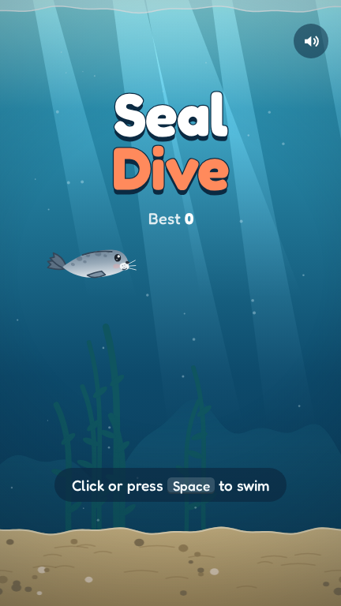
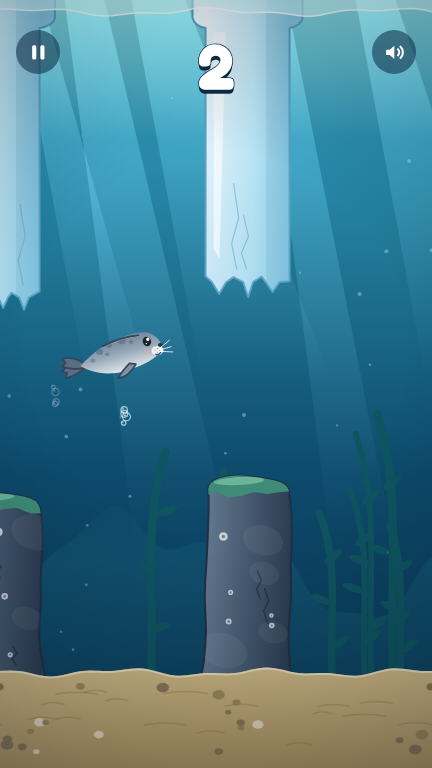
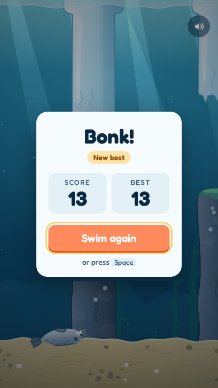

# Seal Dive

A small ocean arcade game. Help the seal swim through the gaps between the ice and the rocks.

**[Play in your browser →](https://emaxiss.github.io/JS_FlappyBirdLikeGame/)**

<p>
  
  
  
</p>

## Controls

| Action       | Keys                          |
| ------------ | ----------------------------- |
| Swim         | Tap, click, `Space` or `↑`    |
| Pause        | `Esc` or `P`                  |
| Sound on/off | `M`                           |

## Run it

Open `index.html` in your browser. No install, no build.

## Publish it on GitHub Pages

1. In the repo, go to **Settings → Pages** and set **Source** to **GitHub Actions**.
2. Push to `master`. The game goes live at `https://<user>.github.io/<repo>/`.

## What's inside

```
index.html      page and menus
css/style.css   styles
js/game.js      the game
fonts/          Fredoka font (SIL Open Font License)
```

The seal, the scenery and the sounds are all made in code. The game loads no images or audio files.
